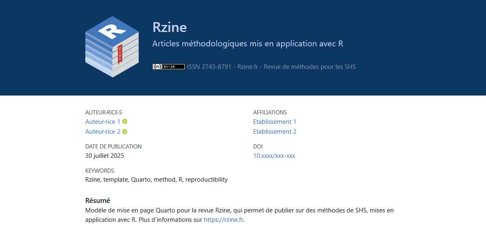

# Template Rzine

**Modèle de mise en page [Quarto](https://quarto.org) pour la revue Rzine** : **https://rzine-reviews.github.io/rzine-article-template/**



## I. Utiliser le template

### a. Créer un nouveau document

Vous pouvez cloner (ou télécharger) le dépôt pour récupérer le modèle de mise en page.

Ou vous pouvez tout simplement utiliser la ligne de commande suivante :


```bash
quarto use template rzine-reviews/rzine-article-template/
```

Cela installe l'extension et créé un répertoire contenant un fichier `index.qmd` (code source de l'article) et des fichiers et répertoires associés.


### b. Appliquer le modèle à un Quarto existant

Depuis le répertoire contenant le fichier .qmd ciblé :

```bash
quarto add rzine-reviews/rzine-article-template/
```

## II. Compiler le document

```bash
quarto render index.qmd --to rzine-html
quarto render index.qmd --to rzine-pdf
```


